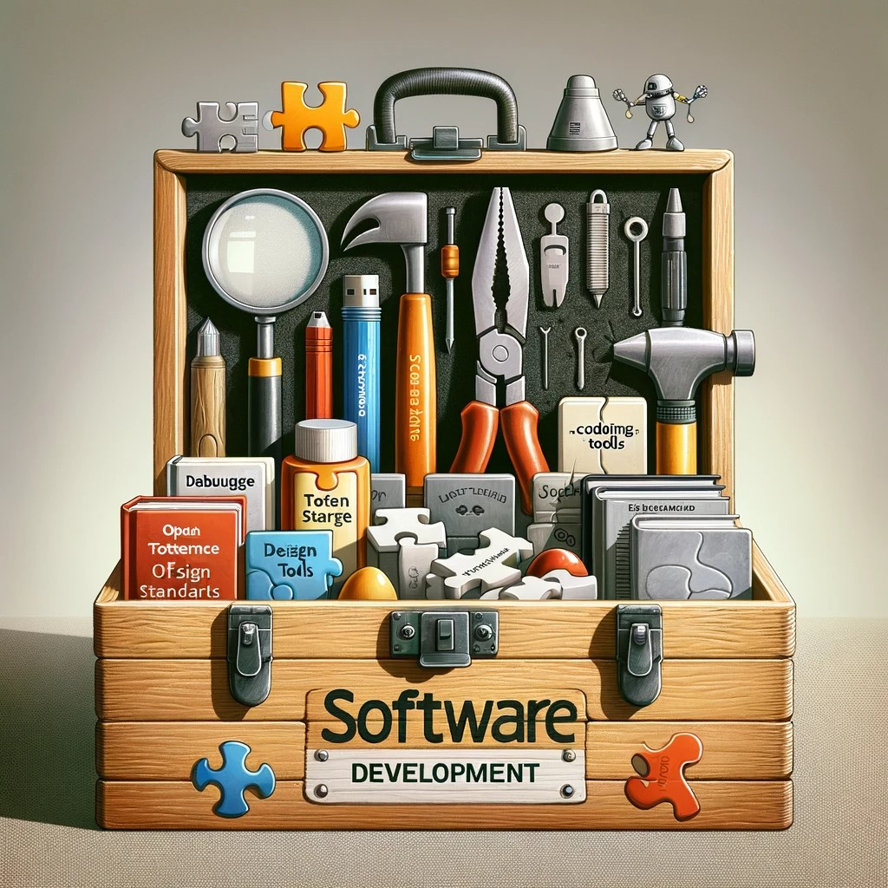

*Exploring Core Principles of Software Engineering.*

As a college student aiming to become a software engineer, I have gained important insights into software engineering through a course that, while focused on web application development, taught me much more. This experience helped me understand key concepts crucial in the broader field of software engineering.

One significant area I learned about is open-source software development. This involves publicly making a software's source code available, allowing anyone to view, modify, and share it. This approach promotes collaboration and improves the quality and innovation of the software. Open source is not just about web applications; it can be used in many areas like operating systems, programming languages, and games. I see myself using open source in various projects in the future, such as developing a new programming tool or utility software, benefitting from the collaborative nature of this approach.

Coding Standards are another key concept I learned. These guidelines for writing code ensure it is consistent, readable, and maintainable. Since software development often involves teamwork, having a standard way of writing code makes it easier for everyone to understand and work on the project. These standards are essential whether I am working on a small project or an extensive system, as they help keep the code organized and accessible for all team members.

Design Patterns were also an essential part of my learning. These are proven solutions to common problems in software design. They act as templates that can be used to solve problems more efficiently. Knowing about design patterns is crucial because it provides me with strategies to tackle different programming challenges. For example, the 'Singleton Pattern' used in web applications to ensure a single object instance can also be applied in desktop applications for managing database connections.

These concepts are not just limited to web application development; they are essential in many software engineering projects. In the future, I plan to apply open-source principles in various projects, whether contributing to existing projects or starting new ones in areas like data analysis or educational software. Coding standards will guide me in writing clear and maintainable code, and design patterns will help me solve complex problems in software development.
In summary, this course has been vital in teaching me about the broader aspects of software engineering. The knowledge and skills I have acquired go beyond web application development and will be helpful in many different types of software projects in my future career. Understanding open-source development, coding standards, and design patterns will be particularly beneficial as I progress in the tech industry.
