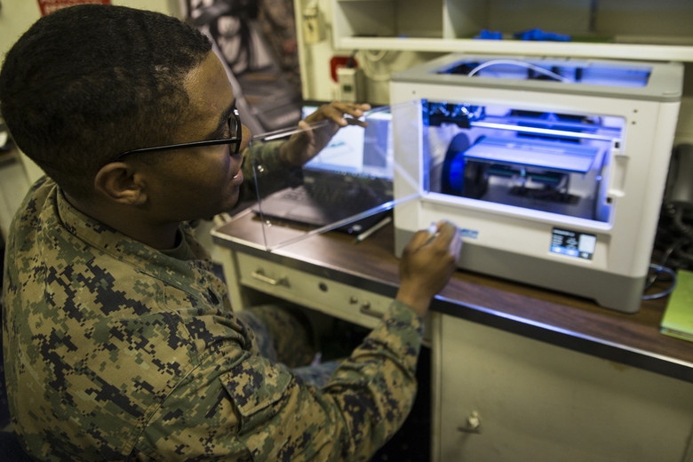

---
layout: project
type: project
image: img/MarinesWithPrinters.jpg
title: "3D Printing Classes"
date: 2019
published: True
labels:
  - SolidWorks
  - 3D Printing
summary: "A course built to teach military members the skills to design and make 3D printed parts"
--- 

At the end of 2017 the Marine Corps decided it wanted to familiarize itself with an emerging technology, 3D printing. The primary goal was to save money by producing in house parts instead of outsourcing to contractors and developing new tools. The Marine Corps decided to create a curriculum centered around building 3D printing skills with hopes of galvanizing an entirely new job field within the Marines. 

I was selected to be the subject matter expert and lead developer of the project due to prior self-taught expertise in the field. Over the course of 5 months, I led a team of 4 in the creation of the Marine Corps Additive Manufacturing Course. During development, I was responsible for creating learning objectives and course goals. I was also in charge of contacting various universities and 3D printing companies to obtain industry certifications that ensured the validity of the course. 

Those 5 months were where I grew the most during my time in the Marines. I learned how to manage a team and delegate to meet deadlines. I developed networking skills and created working relationships in the field. I became an expert in working under stressful conditions and tight deadlines. Overall, I learned how to refine not only my technical abilities but my management skills as well. 

Here is a powerpoint from one lecture about how to use the software that takes a computer animated design and changes it into code read by the 3D printers:
<iframe src="https://onedrive.live.com/embed?resid=D87BB0FC525DEA6C%2118212&authkey=!AHdWvKOlDFo63Z4&em=2" width="800" height="800" frameborder="0" scrolling="no"></iframe>

