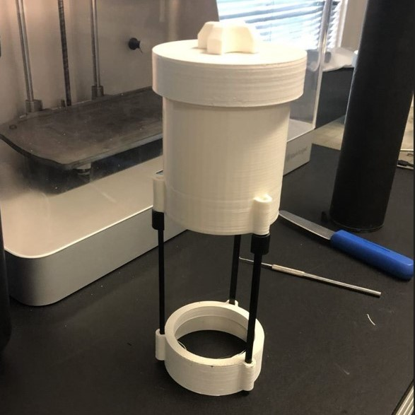
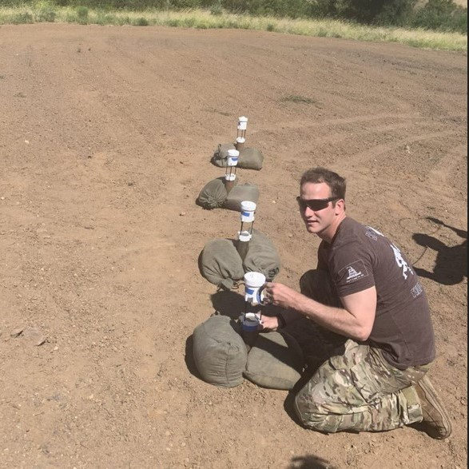
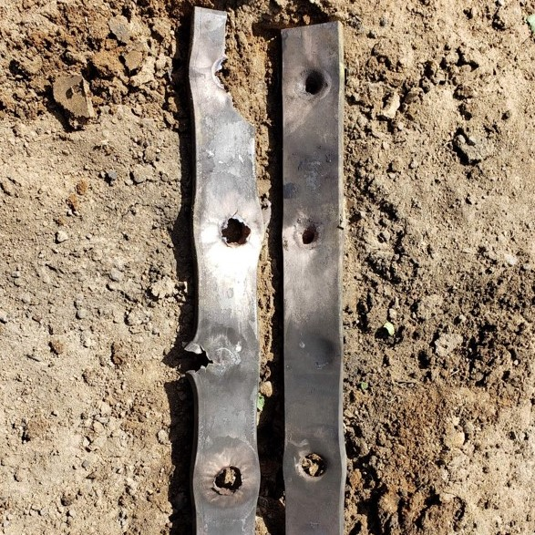

  
  
  

While working as a contractor for the USN in their ammunitions R&D sector we were contacted my EOD to help create a cheaper alternative to their current shape charges. Shaped charges are controlled explosive payloads with a shape that concentrates the blast force into a small one directional blast, creating a plasma jet, that can be used to penetrate thick materials with a much more efficient quantity of explosives
	
I was in charge of research, design, and testing. We had multiple versions each with specific benefits to aid in specialized requirements. We ended up using a copper embedded filament to recreate the copper cone needed for ideal material for penetration. Our final standard version met all requirements with the added benefit of costing around 6 dollars to produce compared to the hundreds of the standard issue versions.
	
The major takeaway from this project was information gathering and reverse engineering. Collaboration with EOD to set up testing and gather input on phases in its development was also a valuable lesson for myself.

