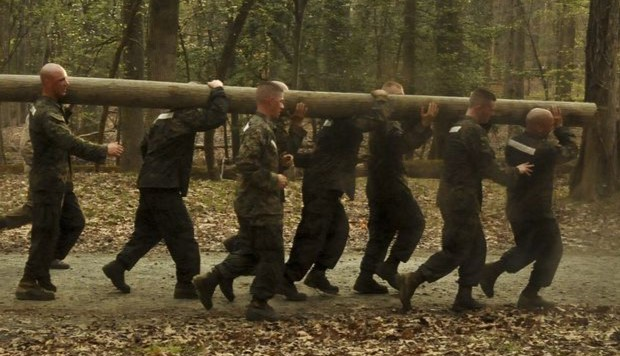

In June 2018 I managed a squadron-wide training event for a group of 1000 Marines. The event consisted of over two dozen technical stations, ranging from radio communications skills to how to apply first aid. The event ensured the readiness of the entire squadron for deployment. 

As the event lead, I was in charge of all the preliminary event details. I scheduled the event, picked the location, and coordinated with all the technical skill instructors. I set up the stations and planned workout events. During the event, I directed all the attendees, provided crisis management, and documented all the critical training data.  After, I was in charge of the clean up crew. 

I learned event planning, scheduling, and large-scale delegation techniques. I gained organizational skills that I utilized throughout the rest of my career, learned how to multi-task effectively,y and built a solid foundation of leadership skills.
