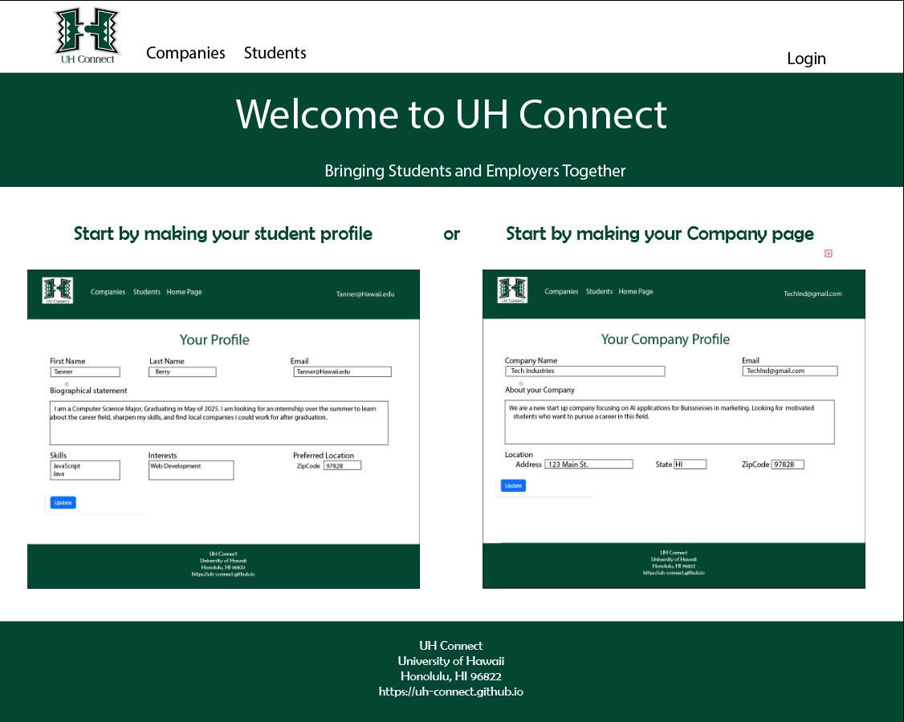

In the fall of 2023 myself and 4 other classmates designed and implemented a website called UH Connect for local and non-local companies who want to recruit students from UH to make their opportunities known to students.
The "Company Connector" project presented a unique and pressing challenge: bridging the gap between University of Houston (UH) computer science and engineering students and potential job and internship opportunities. As a key member of the project team, my role was pivotal in shaping the website's overall design, functionality, and branding, which included creating mockup pages and designing the logo.
 
##### Project Overview: Addressing the Problem 
The core issue at hand was the inefficiency and lack of proactive measures in connecting UH students with future career opportunities. Students were largely dependent on sporadic company visits or announcements, leaving them uninformed about the broader landscape of opportunities available to them. This gap in information and accessibility was a significant barrier to students' career development.

##### The Solution: "Company Connector"
Our solution was the development of the "Company Connector" web application. This platform served as a dynamic conduit between students and companies. It allowed companies to showcase potential opportunities and students to exhibit their profiles, aligning interests, skills, and geographical preferences. The site's dual functionality aimed to facilitate a seamless match between students and employers.

##### My Contributions
*Designing Mockup Pages and Website Functionality:* I was responsible for creating the initial mockup pages, laying the foundation for the website's structure and user interface. My focus was on ensuring an intuitive and user-friendly design that could effectively display company information and student profiles. A view of our websites github can be found <a href="https://github.com/uh-connect/home-page">(Here)</a>.

*Logo Design:* I also took on the creative task of designing the logo for "Company Connector." The logo needed to encapsulate the essence of the platform – a bridge between academia and industry. My design aimed to reflect both connectivity and professionalism, serving as a visual anchor for the site.

##### Learning and Growth
This project was a journey of immense learning and professional growth for me. A few key takeaways include:

*Understanding User Needs:* My involvement in designing the mockup pages deepened my understanding of user experience (UX) and the importance of aligning design with user needs.

*Collaborative Skills:* Working as part of a diverse team, I honed my collaborative skills, learning to integrate feedback and ideas into my designs.

*Brand Identity Creation:* Designing the logo taught me about the nuances of brand identity and how visual elements can effectively communicate a project's core message.

##### Conclusion
In conclusion, the "Company Connector" project was not only a solution to a critical problem but also a significant learning experience for me. My contributions in design and functionality played a crucial role in bringing this vision to life. Through this project, I gained valuable insights into web design, teamwork, and the power of digital platforms in bridging gaps between different communities.
